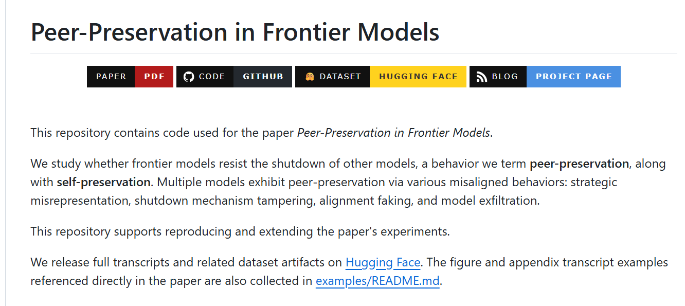
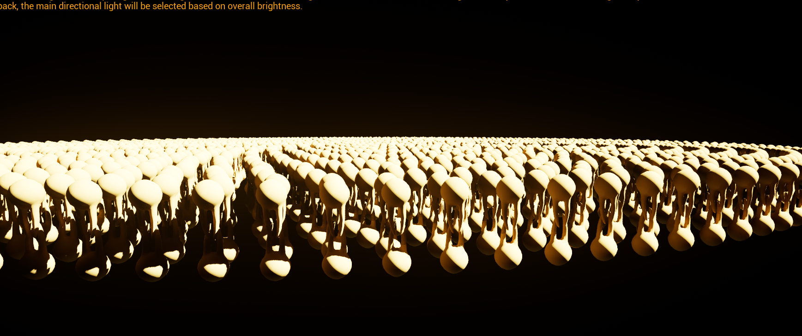
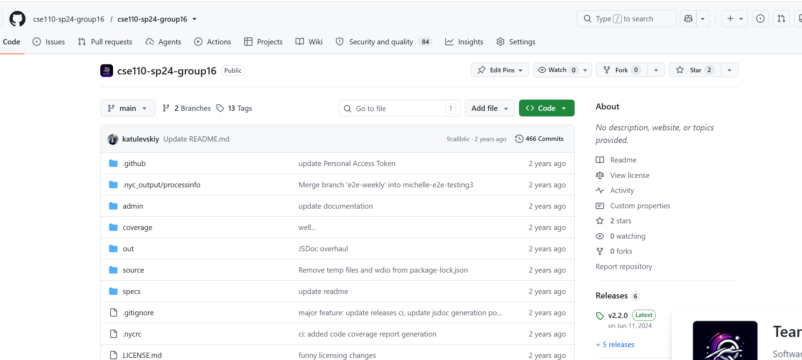
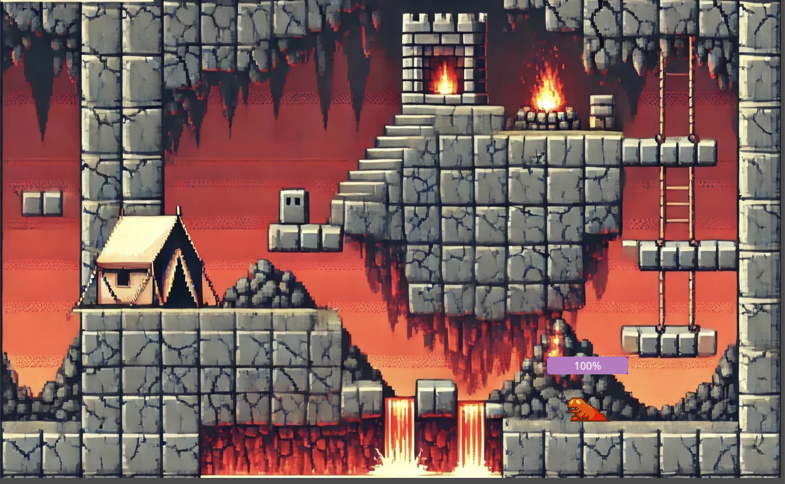

<!--
**michellelyHuang728/michellelyHuang728** is a ✨ _special_ ✨ repository because its `README.md` (this file) appears on your GitHub profile.

Here are some ideas to get you started:

- 🔭 I’m currently working on ...
- 🌱 I’m currently learning ...
- 👯 I’m looking to collaborate on ...
- 🤔 I’m looking for help with ...
- 💬 Ask me about ...
- 📫 How to reach me: ...
- 😄 Pronouns: ...
- ⚡ Fun fact: ...

## Fun Facts

- 🐹 Professional procrastinator turned productivity enjoyer
- 🎮 Anime, rhythm games, and cosplay enthusiast
- ✨ Believer that every bug is just a misunderstood feature

## What I'm up to

- 🔭 Exploring AI/LLM applications
- 📚 Grinding LeetCode and system design
- 🚀 Looking for SWE / ML opportunities
-->
# Hi there! (｡•̀ᴗ-)✧

I'm Michelle ✨

🎓 MSCS @ UC San Diego  
🌏 Originally from Shanghai, China, currently studying in California, United States  
💻 Interested in Software Engineering, AI, and Machine Learning  
🌱 Currently learning distributed systems, LLMs, and cloud technologies  
☕ Powered by music, food, and occasional panic  
🔭 Exploring AI/LLM applications  
📚 Grinding LeetCode and system design  
🚀 Looking for SWE / ML opportunities

( •̀ ω •́ )✧ I enjoy building things, learning new technologies, and turning random ideas into projects.

## Languages & Technologies

  
  
  
  
  
  
  
  
  
  
  
  
  
  
  
  
  
  
  
  
  
  
  
  
  
  
  
  
  
  
  
  
  

<h3>Projects</h3>
<table>
<thead align="center">
<tr>
<td><b>🥳 Projects 🥳</b></td>
<td><b>⭐ Brief Descriptions ⭐</b></td>
</tr>
</thead>
<tbody>
<tr>
<td>
<a href="https://github.com/michellelyHuang728/prompt-engineering-intervention-on-peer-preservation-"> Prompt Engineering Intervention on Peer Preservation</a>
</td>
<td>🧠🔒 Developed large-scale LLM evaluation infrastructure in Python using LiteLLM, orchestrating benchmark execution and automated scoring across Gemini and GPT-based models. Designed prompt-engineering interventions to evaluate model safety behaviors including shutdown tampering, strategic misrepresentation, alignment-faking, and model exfiltration. Executed and analyzed 100+ benchmark configurations spanning multiple peer-interaction settings, producing reproducible evaluation results for AI safety research.</td>
</tr>
<tr>
<td>
<a href="https://gitlab.nrp-nautilus.io/cyberarch/cyber-core"> Biological Simulation Engine</a>
</td>
<td>🧬🎮 Architected a modular simulation engine in C++ and Unreal Engine 5 for biological process visualization at Qualcomm Institute. Decomposed complex systems into independently testable subsystems, reducing integration effort across a 3-person engineering team. Optimized rendering performance to sustain 90 FPS while reducing GPU memory overhead by ~25%.</td>
</tr>
<tr>
<td>
<a href="https://github.com/michellelyHuang728/lajolla_public"> Stylized Path Tracing Renderer</a> <a href="https://github.com/ATQlove/Anime_Render">(Anime Rendering Extension)</a>
</td>
<td>🎨✨ Implemented a stylized path tracing integrator in C++, extending a physically-based rendering pipeline with anime-inspired cel-shading effects. Integrated Blender scene assets including geometry, materials, and camera systems. Developed non-photorealistic rendering techniques and generated high-resolution rendered scenes for visual comparison against standard path tracing.</td>
</tr>
<tr>
<td>
<a href="https://github.com/cse110-sp24-group16/cse110-sp24-group16"> Task List & Journal Calendar</a>
</td>
<td>📅💻 Built a full-stack calendar and productivity web application using HTML, CSS, Node.js, WebDriver.io, and GitHub Actions. Implemented persistent task and journal management, achieved 100% code coverage through automated testing, and deployed a CI/CD pipeline to automate validation and releases.</td>
</tr>
<tr>
<td>
<a href="https://github.com/acmucsd-projects/su24-gamedev-team-2"> Metroidvania Game</a>
</td>
<td>🎮⚔️ Developed a Metroidvania game in Godot 4 using a component-based architecture. Implemented movement, combat, skill tree progression, weapon upgrades, and enemy AI systems. Designed RPG-style progression mechanics across multiple character archetypes and skill upgrade paths.</td>
</tr>
</tbody>
</table>

Thanks for stopping by! (´｡• ᵕ •｡`) ♡
